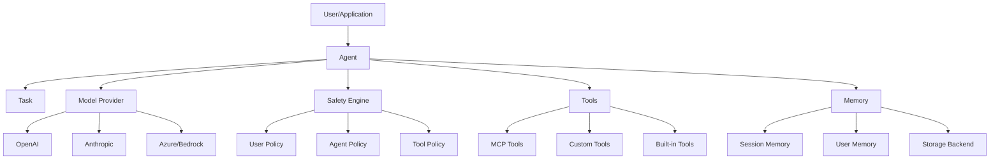

## What is Upsonic?

Upsonic is an open-source AI agent framework designed for building production-ready AI agents and digital workers. It provides a comprehensive toolkit for creating intelligent agents that can interact with external tools, manage memory, enforce safety policies, and coordinate with other agents.

<Note>
Upsonic supports multiple AI providers including OpenAI, Anthropic, Azure, AWS Bedrock, Google, and more through a unified interface.
</Note>

## Key Features

<CardGroup cols={2}>
  <Card title="Multi-Provider Support" icon="layer-group">
    Use OpenAI, Anthropic, Azure, Bedrock, Google, and other providers through a unified API
  </Card>
  
  <Card title="Safety Engine" icon="shield-halved">
    Policy-based content filtering for user inputs, agent outputs, and tool interactions
  </Card>
  
  <Card title="Autonomous Agent" icon="robot">
    Pre-configured agent with filesystem and shell capabilities for coding tasks
  </Card>
  
  <Card title="Memory Management" icon="database">
    Session memory, chat history, and user profile extraction with multiple storage backends
  </Card>
  
  <Card title="Multi-Agent Teams" icon="users">
    Coordinate multiple agents in sequential or parallel workflows
  </Card>
  
  <Card title="Tool Integration" icon="wrench">
    MCP tools, custom tools, and human-in-the-loop workflows
  </Card>
  
  <Card title="OCR Support" icon="file-image">
    Extract text from images and PDFs using multiple OCR engines
  </Card>
  
  <Card title="Production Ready" icon="check-double">
    Monitoring, metrics, enterprise deployment, and cost tracking
  </Card>
</CardGroup>

## Use Cases

### Document Analysis
Extract and process text from images and PDFs with built-in OCR support for invoice processing, form extraction, and document understanding.

### Customer Service Automation
Build agents with memory and session context to provide personalized customer support across multiple conversations.

### Financial Analysis
Create specialized agents that analyze market data, generate reports, and provide insights using tools like YFinance.

### Compliance Monitoring
Enforce safety policies across all agent interactions to ensure content meets regulatory and business requirements.

### Research & Data Gathering
Automate research workflows with multi-agent collaboration, web search tools, and knowledge base integration.

### DevOps Automation
Use AutonomousAgent to read, write, and execute code in sandboxed workspaces for automated DevOps tasks.

## Architecture Overview

Upsonic follows a modular architecture with clear separation of concerns:



### Core Components

<Steps>
  <Step title="Agent">
    The main orchestrator that manages task execution, tool calling, and model interactions. Supports both synchronous (`do`) and asynchronous (`do_async`) execution.
  </Step>
  
  <Step title="Task">
    Defines what the agent should accomplish, including description, tools, response format, and attachments (files/images).
  </Step>
  
  <Step title="Model Provider">
    Abstraction layer for different AI providers. Supports reasoning modes, thinking tools, and provider-specific features.
  </Step>
  
  <Step title="Tools">
    Extend agent capabilities with external tools. Supports functions, tool kits, MCP servers, and agent-as-tool patterns.
  </Step>
  
  <Step title="Memory">
    Persist conversation history and user profiles across sessions using various storage backends (in-memory, SQLite, Redis, PostgreSQL, MongoDB).
  </Step>
  
  <Step title="Safety Engine">
    Apply policies at three checkpoints: user input, agent output, and tool execution to filter PII, adult content, and other sensitive data.
  </Step>
</Steps>

## Why Upsonic?

<AccordionGroup>
  <Accordion title="Production-Ready Out of the Box">
    Unlike lightweight frameworks, Upsonic includes monitoring, cost tracking, safety policies, and error handling - everything you need for production deployments.
  </Accordion>
  
  <Accordion title="Provider Flexibility">
    Switch between OpenAI, Anthropic, Azure, or Bedrock with a single line of code. No vendor lock-in.
  </Accordion>
  
  <Accordion title="Safety First">
    Built-in safety engine with pre-configured policies for PII protection, content filtering, and compliance enforcement.
  </Accordion>
  
  <Accordion title="Autonomous Capabilities">
    AutonomousAgent provides filesystem and shell access in sandboxed environments - perfect for coding assistants and DevOps automation.
  </Accordion>
  
  <Accordion title="Rich Ecosystem">
    Integrate with hundreds of MCP tools, use pre-built tool kits (YFinance, Tavily, DuckDuckGo), or create custom tools.
  </Accordion>
</AccordionGroup>

## Quick Example

Here's a simple example to get a feel for Upsonic:

```python
from upsonic import Agent, Task

# Create an agent
agent = Agent(model="anthropic/claude-sonnet-4-5", name="Assistant")

# Define a task
task = Task(description="Explain quantum computing in simple terms")

# Execute and print the result
agent.print_do(task)
```

<Tip>
Ready to build your first agent? Continue to the [Installation](/get-started/installation) guide.
</Tip>

## Community and Support

- **Documentation**: [docs.upsonic.ai](https://docs.upsonic.ai)
- **GitHub**: [github.com/Upsonic/Upsonic](https://github.com/Upsonic/Upsonic)
- **Issue Tracker**: Report bugs and request features
- **Changelog**: See what's new in each release

## License

Upsonic is released under the MIT License, making it free to use for both personal and commercial projects.
